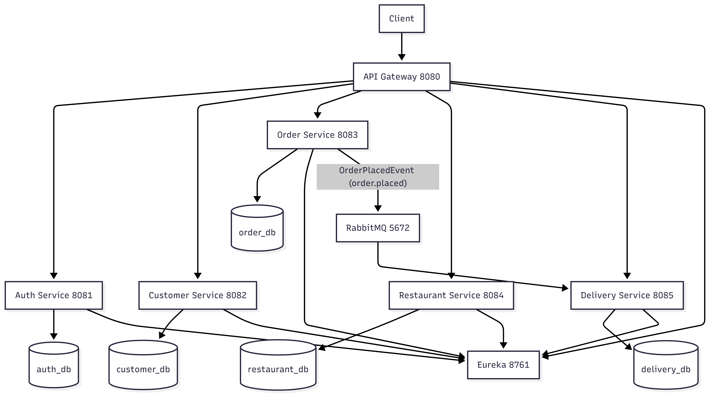
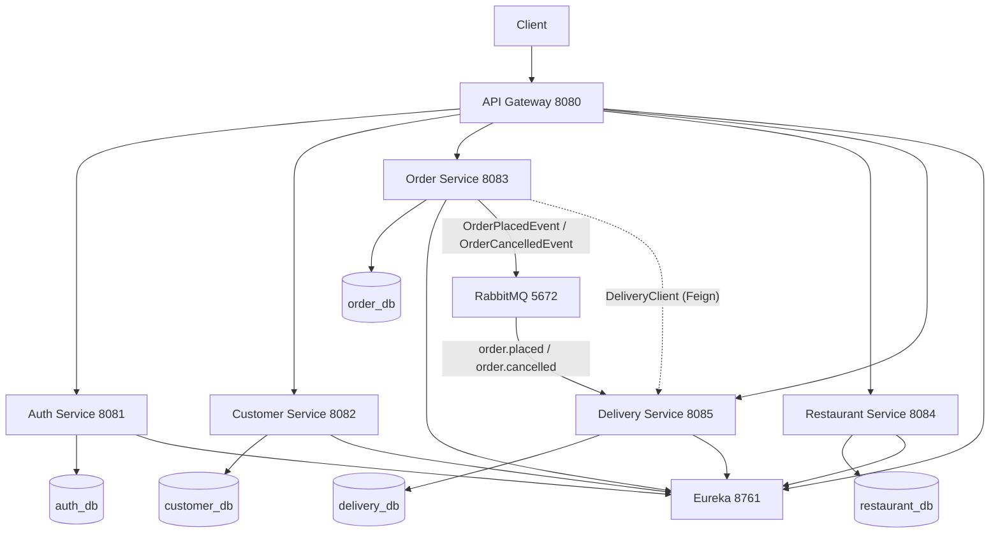

# Architecture Diagram

## Notes
- External traffic enters through the gateway.
- Inter-service lookup uses Eureka service names.
- Delivery assignment is asynchronous through RabbitMQ.
- `RateLimiterFilter` enforces a Resilience4j rate limit (20 req/s) on all `/api/orders/**` requests; excess requests receive HTTP 429 with a `Retry-After` header.
